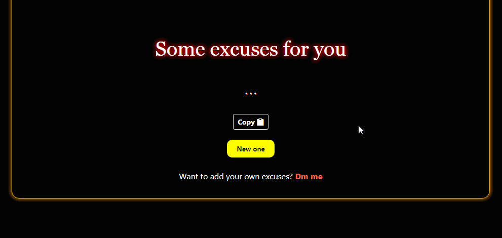

# Ultimate-Excuses 

[](https://github.com/AyushShahh/Ultimate-Excuses/blob/main/LICENSE)
[](https://hits.seeyoufarm.com)
[](https://github.com/AyushShahh/Ultimate-Excuses/stargazers)
[](https://github.com/AyushShahh/Ultimate-Excuses/network)
[](https://github.com/AyushShahh/Ultimate-Excuses/issues)


[](https://twitter.com/intent/tweet?text=Woah!%20This%20is%20so%20cool.%20Check%20it%20out&url=https%3A%2F%2Fgithub.com%2FAyushShahh%2FUltimate-Excuses)

Presenting you the Ultimate Excuse generator that is loaded with lots of excuses for different occassions.

Check the live site **[here](https://ultimatexcuses.netlify.app)**.

## Table of Contents
- [Demonstration](#demonstration-)
- [Brief](#brief)
- [Web App](#web-app)
- [Tech Stack](#tech-stack)
- [External Libraries used](#external-libraries-used)
- [Frameworks used](#frameworks-used)
- [To-Do list](#to-do-list)
- [Got some questions?](#got-some-questions)
- [Found a bug?](#found-a-bug)
- [Contributing](#contributing)
- [Submitting an Excuse](#submitting-an-excuse)
- [LICENSE](#license-%EF%B8%8F)
- [Contact](#contact)

## Demonstration ✨


## Brief
With a lot of excuses, this site can help you if you get stuck in some situations. Keep pressing the button until you get the excuse you want.<br>
After that, copy the excuse by pressing the copy button.<br>
It is as simple as that.

## Web App
 While you can go to the browser everytime for using the [website](https://ultimatexcuses.netlify.app), I would suggest you to use the **web app** so that you don't have to go to the browser and type in the website everytime. You can directly open the **web application** on your **home screen** or the **desktop shortcut** on your computer to use the website.<br>

 **Follow the steps:**
1. For desktop users
- Chrome
    - Open the [website](https://ultimatexcuses.netlify.app)
    - Tap the **three dots &#8942;** on the top right corner
    - Click on **More tools**
    - Click on **Create shortcut**
    - Check **Open as window** option and click create
2. For mobile users
- Chrome
    - Navigate to the [website](https://ultimatexcuses.netlify.app)
    - Tap the **three dots &#8942;** on the top right corner
    - Scroll down and click on **Add to home screen**
    - Click **Add**
- Safari
    - Navigate to the [website](https://ultimatexcuses.netlify.app)
    - Click on **Share icon** at bottom<br> 
    (On the iPad, share icon is located at the **top-right**)
    - Tap **Add to home screen** from the menu
    - Type name for shortcut and then tap **Add** button

Now you can use this site as a **Web App**.<br>
The process might be similar for other browsers too.

## Tech-Stack
Languages used:
1. **HTML5**<br>
2. **CSS3**<br>
3. **JavaScript**

## External Libraries used
[jQuery](https://jquery.com/) - jQuery is a JavaScript library. jQuery takes a lot of common tasks that require many lines of JavaScript code to accomplish, and wraps them into methods that you can call with a single line of code.

[PWACompat](https://github.com/GoogleChromeLabs/pwacompat) - PWACompat is a library that brings the Web App Manifest to non-compliant browsers for better Progressive Web Apps.<br>
Read more on their [blog](https://developers.google.com/web/updates/2018/07/pwacompat).

[Popper.js](https://popper.js.org/) - It helps to easily position tooltips and popovers.

## Frameworks used
[Bootstrap 4](https://getbootstrap.com/) - Bootstrap is a free and open source front end development framework for the creation of websites and web apps. The Bootstrap framework is built on HTML, CSS, and JavaScript (JS) to facilitate the development of responsive, mobile-first sites and apps. 

## To-Do list
- [ ] Categorize excuses in groups for specific situations and needs
- [ ] Adding submit excuse form

## Got some questions?
If you got some questions or you want to tell something, you can discuss them in the [discussions](https://github.com/AyushShahh/Ultimate-Excuses/discussions) tab.

## Found a bug?
If you find a bug, you can always **open an issue** in the [issues tab](https://github.com/AyushShahh/Ultimate-Excuses/issues) to talk about it. Still, if you want to **contact me**, check [here](#contact).

---
**Note:** Make sure you browse through the existing issues to check if the issue already exists.<br>
>Know a fix or want to contribute? Check **contributions** section.

## Contributing
Pull requests are always welcome. But before making any major changes you can open an [issue](https://github.com/AyushShahh/Ultimate-Excuses/issues) to discuss.<br>
For less major or minor changes, you can open a [pull request](https://github.com/AyushShahh/Ultimate-Excuses/pulls).

### Submitting an Excuse
You can go to [this](https://github.com/AyushShahh/Ultimate-Excuses/blob/main/scripts/excuses.js) file and add your own excuse like this:
```javascript
excuse['number after the previous excuse'] = "Your excuse goes here inside quotes";
```

**Thanks for contributing.**
 
## LICENSE 🛡️
This project is licensed under the MIT License - see the **[`LICENSE`](https://github.com/AyushShahh/Ultimate-Excuses/blob/main/LICENSE)** file for details.

# Contact
I don't like spams

<p>
<a href="https://twitter.com/ayushshah__" target="_blank" rel="noopener noreferrer"></a>  
&nbsp; <a href="https://www.instagram.com/ayushshah__/" target="_blank" rel="noopener noreferrer"></a>
&nbsp; <a href="https://www.quora.com/profile/Ayush-Shah-133/" target="_blank" rel="noopener noreferrer"></a>
&nbsp; <a href="https://www.clubhouse.com/@ayushshah_" target="_blank" rel="noopener noreferrer"></a>
&nbsp; <a href="https://www.discordapp.com/users/810944110046740491" target="_blank" rel="noopener noreferrer"></a><br><br>

**[Back to top](#ultimate-excuses-)**
